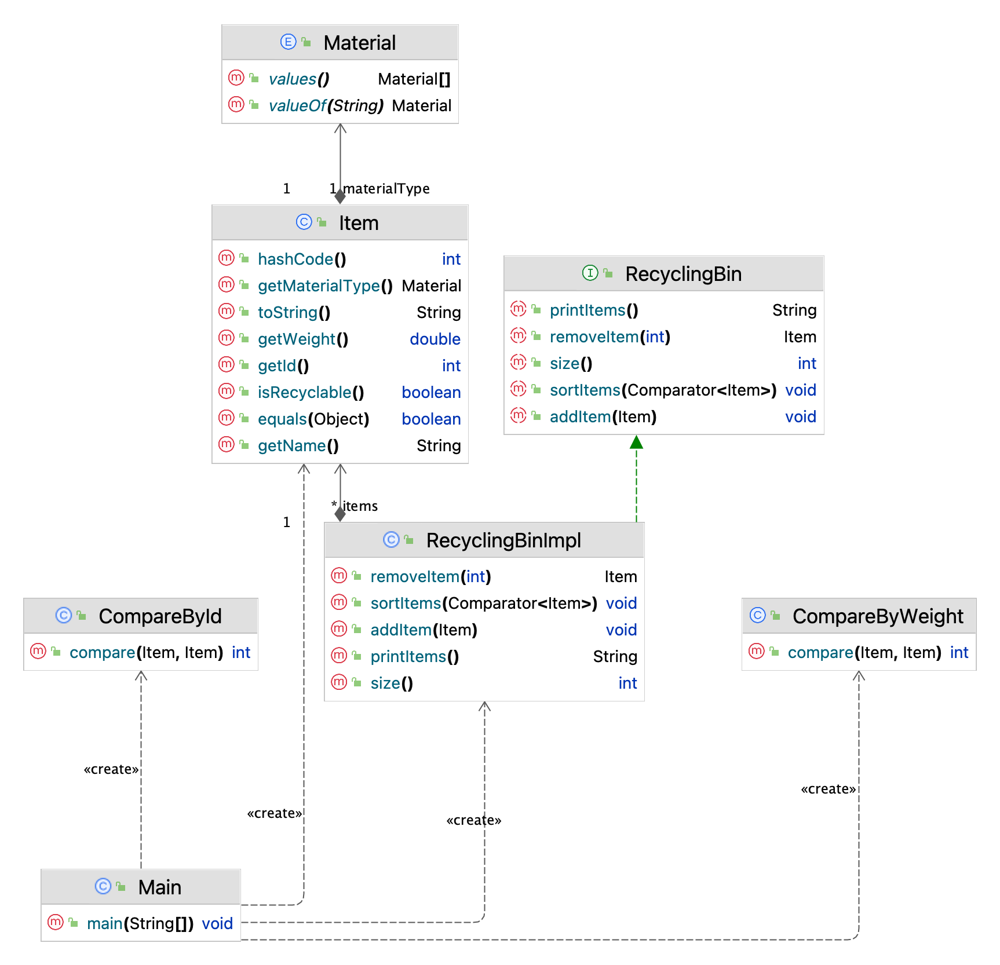

# CS 5004 Lab 3 - Recycling Items Sorting System

## Overview
In this lab, you will create a Recycling Items Sorting System designed to sort various recyclable items like bottles, containers, and cans based on their material type (glass, plastic, aluminum, etc.) and other properties (weight, recyclability). This project aims to demonstrate the application of object-oriented design principles, abstract data types (ADTs), and sorting algorithms to efficiently manage and sort recycling items.

## Objectives
- Implement ADTs to organize and manage recyclable items.
- Implement sorting algorithms or utilize Java's sorting capabilities with custom criteria.

## Assignment Setup

### Project's Diagram
Please review the following diagram to become familiar with the structure of the code and the relationships between classes and interfaces (we have hidden information about the fields so that you can focus on the methods and relationships).

These are the high-level components of the system:

### Item class
- **Base Class `Item`**: Contains attributes such as `name`, `id`, `materialType`, `weight`, and `isRecyclable`. Please complete this class by writing the `hashCode` and `equals` methods.
- **Unit tests for the `Item` class**: We have written a few unit tests. Make sure that your implementation of `equals` and `hashCode` passes these tests. Feel free to add more tests if you think it is necessary.

### Abstract Data Type (ADT) for Recycling Bin
- **Interface `RecyclingBin`**: Defines methods for adding, removing, and sorting items.
- **Class `RecyclingBinImpl`**: You need to implement the `RecyclingBin` interface using a collection to manage the items. You have the freedom to choose the appropriate collection type.
- **Unit tests for the `RecyclingBin` interface**: Please write unit tests to ensure that your implementation of `RecyclingBinImpl` is correct.

### Sorting Mechanism
- **Method `sortItems()`** in `RecyclingBinImpl`: Sorts the recyclable items by specified criteria using `Comparator`.
- **`Comparator` implementations**: You need to implement `Comparator` classes to sort the items based on two different criteria: material type and weight.
- **Unit tests for the sorting mechanism**: Please write unit tests to ensure that your sorting mechanism is working correctly.

## Driver class
- **`Main` class**: We have written a `Main` class to test your implementation. Please make sure that your implementation works with the provided `Main` class by producing meaningful output.

## How to submit
- Create a zip file that contains directly your <em>src</em> and <em>test</em> folders. When you unzip the file, you should see only these two folders.
- Log on to Gradescope.
- Wait for a few minutes for feedback to appear, and take action if needed.

## Evaluation Criteria
- Application of object-oriented design principles and Java best practices.
- Correct implementation and functionality of ADTs and sorting mechanisms.
- Completeness and correctness of unit tests.
